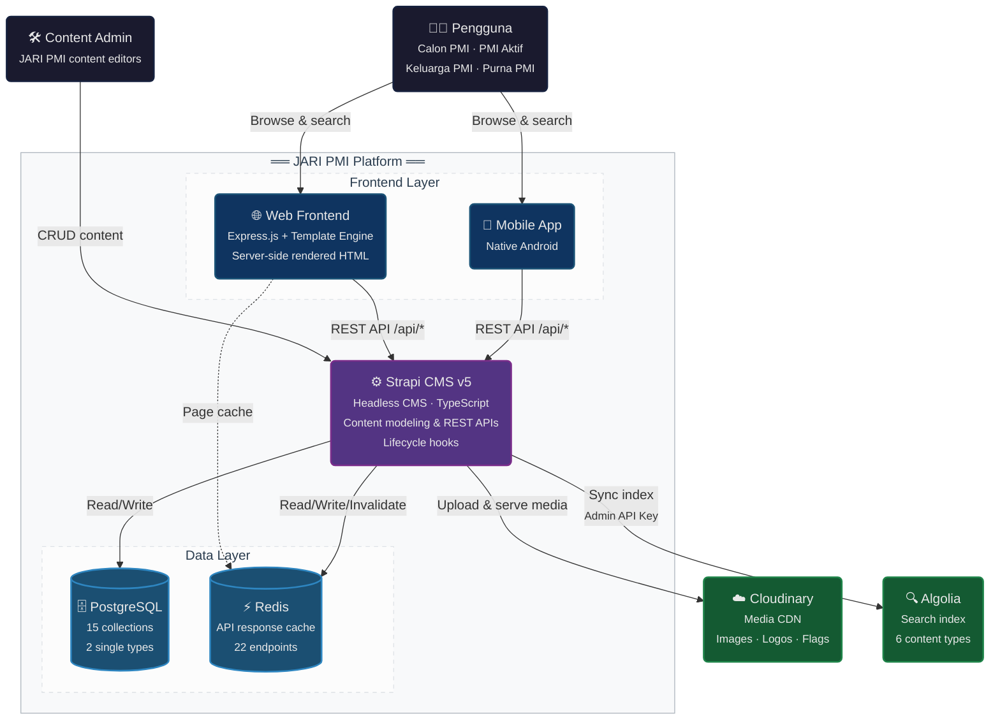

# JARI PMI — Container Diagram (C4 Level 2)

## Containers

| Container | Technology | Role |
|-----------|-----------|------|
| **Web Frontend** | Express.js + Template Engine | Server-side rendered HTML pages; 13 page types |
| **Mobile App** | Native Android | Native mobile experience; same 13 page types |
| **Strapi CMS v5** | Node.js + TypeScript | Headless CMS — REST APIs, content modeling, lifecycle hooks |
| **PostgreSQL** | Relational Database | Content persistence — 15 collections, 2 single types, components |
| **Redis** | In-memory Cache | API response cache (22 endpoints) + SSR page cache |

## Relationships

| # | From | To | Protocol | Description |
|---|------|----|----------|-------------|
| 1 | Pengguna | Web Frontend | HTTPS | Browse 13 page types via browser |
| 2 | Pengguna | Mobile App | HTTPS | Same pages via native Android app |
| 3 | Content Admin | Strapi CMS | HTTPS | Create, edit, publish content via Admin Panel |
| 4 | Web Frontend | Strapi CMS | HTTPS | All dynamic content via REST API |
| 5 | Mobile App | Strapi CMS | HTTPS | Same REST API consumption |
| 6 | Web Frontend | Redis | TCP | SSR page-level caching |
| 7 | Strapi CMS | PostgreSQL | TCP | Content persistence |
| 8 | Strapi CMS | Redis | TCP | API response caching; invalidated via lifecycle hooks |
| 9 | Strapi CMS | Cloudinary | HTTPS | Media upload & CDN delivery |
| 10 | Strapi CMS | Algolia | HTTPS | Lifecycle hooks sync 6 searchable content types |

## Design Rules

- **No direct external access** — Frontends never call Algolia; all search proxied through `/api/search`
- **Cache layers** — Strapi caches API responses in Redis; Web Frontend caches SSR pages in Redis
- **Media isolation** — All assets served via Cloudinary CDN, never stored in PostgreSQL
- **Search isolation** — Algolia write-only via lifecycle hooks, read-only via search proxy
