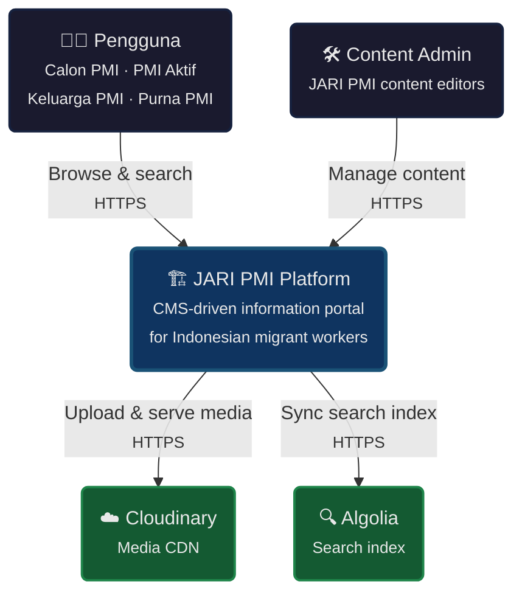

# JARI PMI — System Context Diagram (C4 Level 1)

## Overview

The **JARI PMI Platform** is a CMS-driven information portal serving Indonesian migrant workers. At the highest level, the system interacts with 2 user types and depends on 2 external services.

| Actor | Role |
|-------|------|
| **Pengguna** | Indonesian migrant workers (Calon PMI, PMI Aktif, Keluarga PMI, Purna PMI) browsing web or mobile |
| **Content Admin** | JARI PMI editors managing dynamic content via Strapi Admin Panel |

| External System | Purpose |
|-----------------|---------|
| **Cloudinary** | Media asset CDN — stores and serves images, logos, flags, avatars |
| **Algolia** | Global search index — 6 content types searchable via proxy API |

## Design Rules

- **Single user persona** — Same users access both web and mobile; Pengguna = all 4 PMI types
- **No direct external access** — Users never call Cloudinary or Algolia directly
- **Search proxied** — All search queries go through the platform, never directly to Algolia
- **Media proxied** — All media uploads and delivery handled through the platform via Cloudinary
